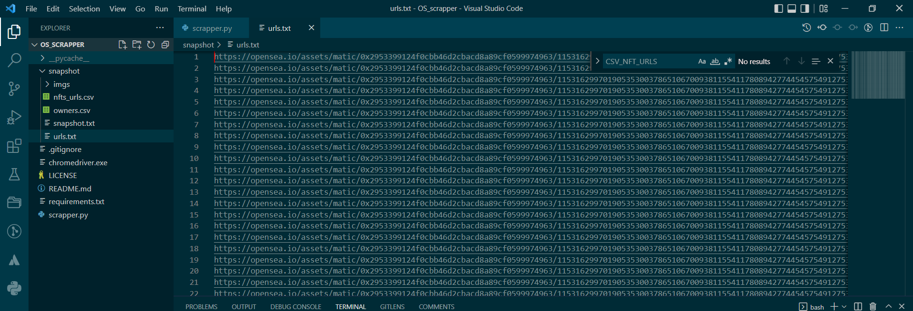

This script is intended for scrapping (collecting information) an NFT collection on OpenSea. This is usefull for lazy minted polygon collection, since the OpenSea API (v1) still doesn't support polygon collections.

The script uses Selenium lib, along with the chromedriver.exe (to be downloaded separately). It emultes a regular user going through an OpenSea collection an scrapping all the info (URL, images, title, owner, etc).

I run it from Visual Studio Code on Windows, but it can be adapted to run on linux too. Due to the "slow" page web page loading, it can be slow. In general, count around 10-20 seconds per NFT, but it can be ran and forgotten (in the background), once started, the script works on its own. 

## CONFIG (mandatory)
* COLLECTION_URL --> The OpenSea URL to the collection page. Make sure to sort it in ascending order
* CURRENT_COLLECTION_SIZE --> Number of NFTs currently in the collection (not the final/max collection size)

### Optional config changes
The variables do not necessarily need any modifications, the default values can be used.
* SNAPSHOT_DIR --> Relative path to the snapshot directory, where the script will output all the files it produces/fetches
* NFT_URL_LIST_FILE, SNAPSHOT_FILE, CSV_OWNER_FILE, CSV_NFT_URLS, IMGS_DIR --> These are the names of the files that will be produced inside SNAPSHOT_DIR
It is possible OpenSea changes their UI layout/structure in the future. If that is the case, the various _XPATH variables will require updating. See XPATHs below. (OWNER_XPATH, NFT_NAME_XPATH, NFT_IMG_XPATH, COLLECTION_PAGE_GRID_BTN_XPATH, COPY_ADDRESS_BUTTON_XPATH)

## Script Arguments
* debug --> sets debug to True. Only runs through the first 50 NFTs, for testing.
* coll --> Scrappes the collection and produces the NFT_URL_LIST_FILE file list
* nft --> DEPENDS on NFT_URL_LIST_FILE (this means you need to run coll at least once, before this) and produces SNAPSHOT_FILE .json file
* csv --> DEPENDS on SNAPSHOT_FILE (you need to run coll and nft before this) and produces CSV_OWNER_FILE and CSV_NFT_URLS files. First one is a .csv file, mapping each address to a list of tokens owned. The second file is simply a .csv of of each NFT id and a URL to its OpenSea page. These files are the snapshot files that you can provide to your users, BEFORE the migration, so they can confirm all tokens will be properly airdropped to their respective owners.
* imgs --> Depends on SNAPSHOT_FILE and produces the folder IMGS_DIR, containing all the NFT images from OpenSea

debug option can be used in conjunction with any other function. You need to use the functions in the order provided above (they depend on previous function outputs). An easier way is also to run everything in one command. E.g.

debug
`python scrapper.py debug coll nft csv imgs`

no debug
`python scrapper.py coll nft csv imgs`

